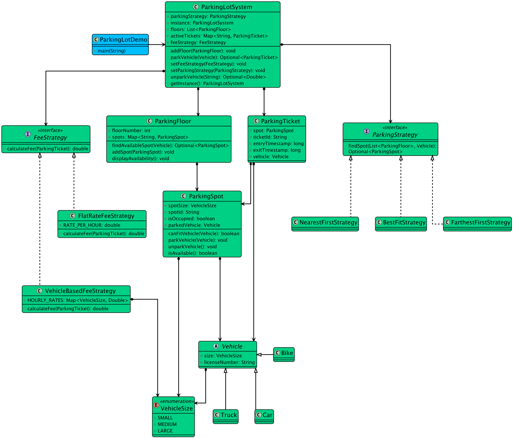
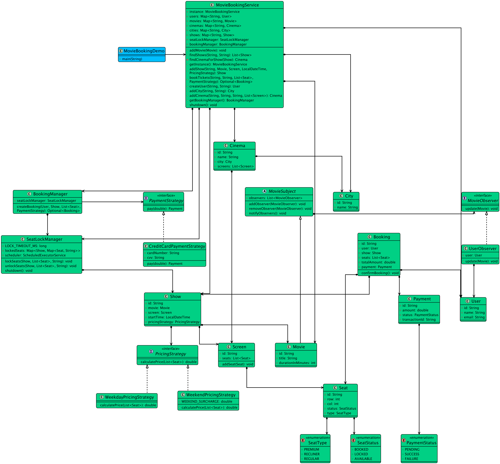
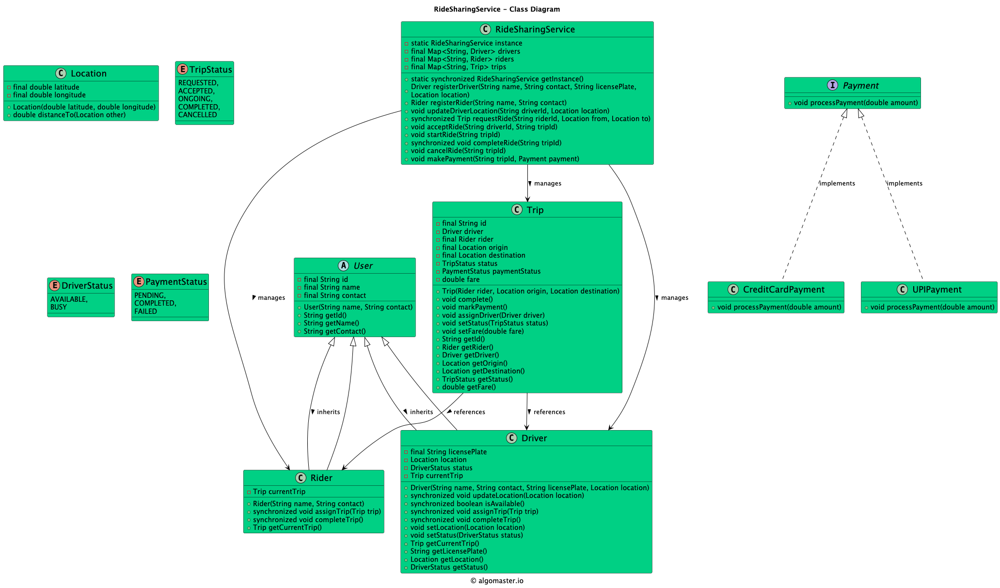
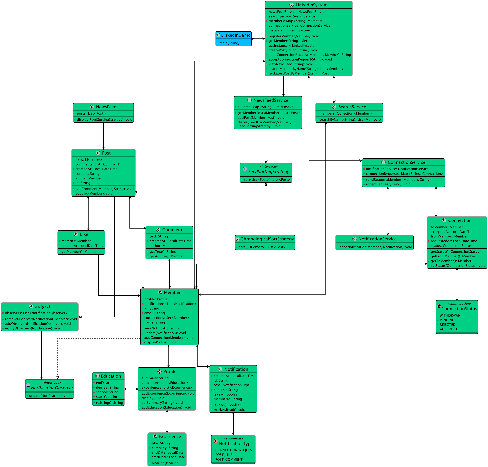

  <h1>Low-Level Design Handbook — Dark Edition</h1>
  
<strong>A high-contrast study companion for senior and staff software engineer interview prep</strong>

  

    
    
    
  

---

  <strong>Purpose:</strong> use this as a visually stronger reading mode for GitHub and markdown viewers that preserve inline HTML styles.

  <strong>Mindset:</strong> staff-level LLD is not about writing more classes. It is about making better boundaries, cleaner tradeoffs, and clearer explanations.

## Core preparation pillars

<table>
  <tr>
    <th align="left">Pillar</th>
    <th align="left">What good looks like</th>
  </tr>
  <tr>
    <td>Object modeling</td>
    <td>Entities, value objects, ownership, invariants, responsibilities</td>
  </tr>
  <tr>
    <td>Design judgment</td>
    <td>Simplicity first, extensibility where justified, no abstraction cosplay</td>
  </tr>
  <tr>
    <td>Correctness</td>
    <td>Concurrency, race conditions, state transitions, failure paths</td>
  </tr>
  <tr>
    <td>Communication</td>
    <td>Structured explanation, explicit assumptions, crisp tradeoffs</td>
  </tr>
</table>

## Reading path

1. `../fundamentals/oop-java/`
2. `../Design-Patterns.md`
3. `uml-cheatsheet.md`
4. `interview-answer-template.md`
5. `../study-roadmap/04-8-week-roadmap.md`
6. `../staff-prep-checklist.md`

## Visual anchors from this repo

<table>
  <tr>
    <td align="center"><strong>Parking Lot</strong> </td>
    <td align="center"><strong>Movie Booking</strong> </td>
  </tr>
  <tr>
    <td align="center"><strong>Ride Sharing</strong> </td>
    <td align="center"><strong>LinkedIn</strong> </td>
  </tr>
</table>

## Staff-level reminders

  <strong>Say this explicitly:</strong>
  <ul>
    <li>what assumptions you are making,</li>
    <li>what is out of scope,</li>
    <li>where concurrency risk exists,</li>
    <li>what would change in production.</li>
  </ul>

  <strong>Avoid this:</strong>
  <ul>
    <li>introducing patterns before identifying variation,</li>
    <li>mixing domain logic with persistence and IO details,</li>
    <li>ignoring invariants like double booking, duplicate payment, or stale state,</li>
    <li>turning a 45-minute interview into accidental enterprise architecture fan fiction.</li>
  </ul>

## Companion docs
- `lld-handbook.md`
- `interview-answer-template.md`
- `uml-cheatsheet.md`
- `../study-roadmap/README.md`
- `../staff-prep-checklist.md`
