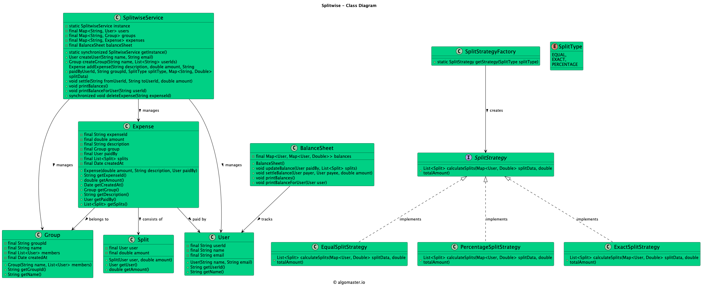
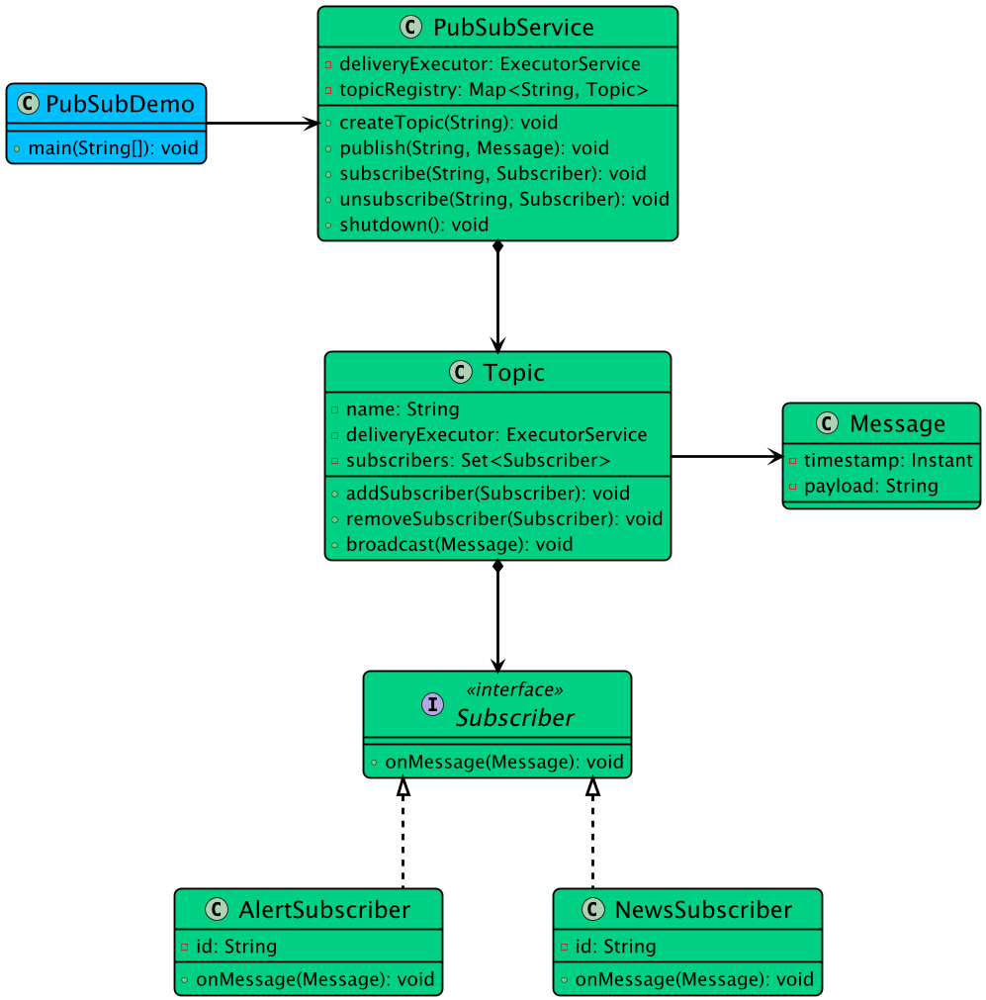

# Low-level design handbook

A practical study guide for senior and staff software engineer interviews.

This handbook organizes the repository into a structured preparation path.
Use it to connect fundamentals, design patterns, problem statements, diagrams,
and implementations.

## Handbook navigation
- [Object-oriented foundations](#object-oriented-foundations)
- [Design principles](#design-principles)
- [UML and diagramming](#uml-and-diagramming)
- [Design patterns](#design-patterns)
- [Interview answering framework](#interview-answering-framework)
- [Problem progression](#problem-progression)
- [Staff-level expectations](#staff-level-expectations)
- [Repository study map](#repository-study-map)

  <strong>Purpose:</strong> This is a repository-native guide. It helps you use
  the material in this repository as a coherent study plan instead of a random
  pile of design examples.

## Object-oriented foundations

Before design patterns and diagrams, you need clear object-modeling instincts.

### Object-oriented foundation topics to revise
- abstraction
- encapsulation
- inheritance
- composition
- aggregation
- association
- interfaces
- polymorphism

### Object-oriented foundation resources in this repository
- `fundamentals/oop-java/abstraction/`
- `fundamentals/oop-java/encapsulation/`
- `fundamentals/oop-java/inheritance/`
- `fundamentals/oop-java/polymorphism/`
- `fundamentals/oop-java/interfaces/`
- `fundamentals/oop-java/association/`
- `fundamentals/oop-java/aggregation/`
- `fundamentals/oop-java/composition/`

  <strong>Interview tip:</strong> Composition is often the safer default. If you
  reach for inheritance too early, there is a good chance you are modeling code
  reuse instead of domain truth.

### Object-oriented foundation questions to answer
- Why is this a class and not just a field or enum?
- What data must be hidden?
- Which behavior actually varies?
- Is inheritance expressing an actual "is-a" relationship?

## Design principles

Principles matter more than jargon.

### Design principles that interviewers actually care about
- **SOLID** for separation and extensibility
- **DRY** for avoiding duplicated business rules
- **YAGNI** for not building fantasy features
- **KISS** for keeping the model understandable

### Design principle resources in this repository
- `Design-Patterns.md`
- `Distributed-Systems-Pattern.md`
- `staff-prep-checklist.md`

### Design principle translation for interviews

| Principle | Interview meaning |
|---|---|
| SOLID | classes and interfaces have clear responsibilities |
| DRY | business rules are centralized, not copied everywhere |
| YAGNI | you do not invent abstractions for requirements nobody asked for |
| KISS | the interviewer can still follow your answer after 20 minutes |

  <strong>Anti-pattern:</strong> Naming every principle is not the same as
  applying it. A short, coherent design beats a buzzword-heavy mess.

## UML and diagramming

You do not need perfect UML. You need useful UML.

### UML and diagramming checklist
- draw main entities first
- show ownership and containment
- show key relationships
- introduce interfaces where behavior varies
- add cardinality only where it clarifies a core rule

### UML and diagramming pitfalls to avoid
- every getter and setter
- every helper class
- persistence framework noise
- implementation trivia

### UML and diagramming resources in this repository
- `assets/class-diagrams/`
- `problem-statements/`
- `docs/uml-cheatsheet.md`

### UML and diagramming examples from this repository

<table>
  <tr>
    <td align="center"><strong>Parking Lot</strong> </td>
    <td align="center"><strong>LinkedIn</strong> </td>
  </tr>
  <tr>
    <td align="center"><strong>Splitwise</strong> </td>
    <td align="center"><strong>Pub-Sub</strong> </td>
  </tr>
</table>

## Design patterns

Patterns are tools, not decorations.

### Creational patterns
Useful when object creation is complex or varies by policy.
- singleton
- factory
- abstract factory
- builder
- prototype

### Structural patterns
Useful when object composition and adaptation matter.
- adapter
- bridge
- composite
- decorator
- facade
- flyweight
- proxy

### Behavioral patterns
Useful when flows, responsibilities, and behavior vary.
- strategy
- observer
- command
- state
- template method
- chain of responsibility
- mediator
- visitor
- iterator
- memento

### Design pattern resources in this repository
- `design-patterns/java/`
- `Design-Patterns.md`

### Design pattern guidance for interviews

| Pattern | Common interview use |
|---|---|
| Strategy | pluggable pricing, ranking, sorting, allocation |
| Observer | notifications, event listeners, state propagation |
| State | order lifecycle, booking lifecycle, workflow stages |
| Factory | polymorphic object creation |
| Command | undo and redo, action queues |
| Chain of Responsibility | validation or processing pipelines |

  <strong>Staff-level signal:</strong> Explain why a pattern helps, but also
  when you would avoid it. Judgment is more valuable than pattern recitation.

## Interview answering framework

Use this sequence when solving LLD problems.

### Interview answering step 1: clarify scope
Ask about:
- must-have features
- edge cases
- concurrency expectations
- scale assumptions
- persistence assumptions
- out-of-scope features

### Interview answering step 2: identify core entities
Define:
- actors
- entities
- value objects
- relationships
- lifecycle states

### Interview answering step 3: define workflows
Walk through:
- happy path
- failure path
- concurrency-sensitive path
- extensibility-sensitive path

### Interview answering step 4: sketch classes and interfaces
Focus on:
- cohesion
- ownership
- invariants
- extension points

### Interview answering step 5: discuss scale and operations
Examples:
- locking
- idempotency
- ordering
- caching
- indexing
- retries
- notifications
- eventual consistency

### Interview answering step 6: call out tradeoffs
This is where stronger candidates separate themselves.

## Problem progression

### Easy problem progression set
- parking lot
- vending machine
- coffee vending machine
- logging framework
- tic tac toe
- traffic signal

### Medium problem progression set
- ATM
- LinkedIn
- LRU cache
- pub-sub system
- elevator system
- car rental system
- hotel management system
- digital wallet service

### Hard problem progression set
- ride sharing service
- movie ticket booking system
- online shopping service
- online stock brokerage system
- splitwise
- cricinfo
- food delivery service
- course registration system

For structured groupings, see:
- `study-roadmap/01-by-difficulty.md`
- `study-roadmap/02-by-company-style.md`
- `study-roadmap/03-by-theme.md`

## Staff-level expectations

At staff level, the bar is not just "can write classes."

### Staff-level capabilities to demonstrate
- clear tradeoff reasoning
- strong scoping judgment
- ability to discuss failure and concurrency
- separation of domain logic, orchestration, and infrastructure
- awareness of what to simplify in interview context

### Staff-level answer examples
Strong answer patterns:
- "I would keep payments out of the first-pass object model and define an interface boundary."
- "The concurrency risk is double booking, so I would model reservation state and commit validation explicitly."
- "I am using strategy here because the ranking logic is likely to change independently."
- "In production I would add persistent storage and retries, but in interview scope I will keep them behind repository and notifier interfaces."

Weak answer patterns:
- "I will create 27 classes first."
- "Everything will be a singleton."
- "We can scale later."
- "I added inheritance because Java has inheritance."

## Repository study map

### Repository study map starting points
- `study-roadmap/README.md`
- `study-roadmap/04-8-week-roadmap.md`
- `staff-prep-checklist.md`

### Repository study map practice materials
- `problem-statements/`
- `assets/class-diagrams/`
- `reference-implementations/java/`
- `solutions/`

### Repository study map selective revision docs
- `docs/parking-lot.md`
- `docs/food-delivery.md`
- `docs/lru-cache.md`
- `docs/chess-game.md`
- `docs/movie-ticket-booking.md`
- `docs/truecaller.md`

## Final advice

  <strong>Strong LLD prep is not about collecting more examples.</strong> 
  It is about getting better at identifying boundaries, invariants, tradeoffs,
  and simplifications under time pressure.

If your answer is elegant but impossible to explain, it is not interview ready.
If your answer is scalable but ignores core domain rules, it is not design ready.
If your answer is simple and deliberate, now you are getting somewhere.
