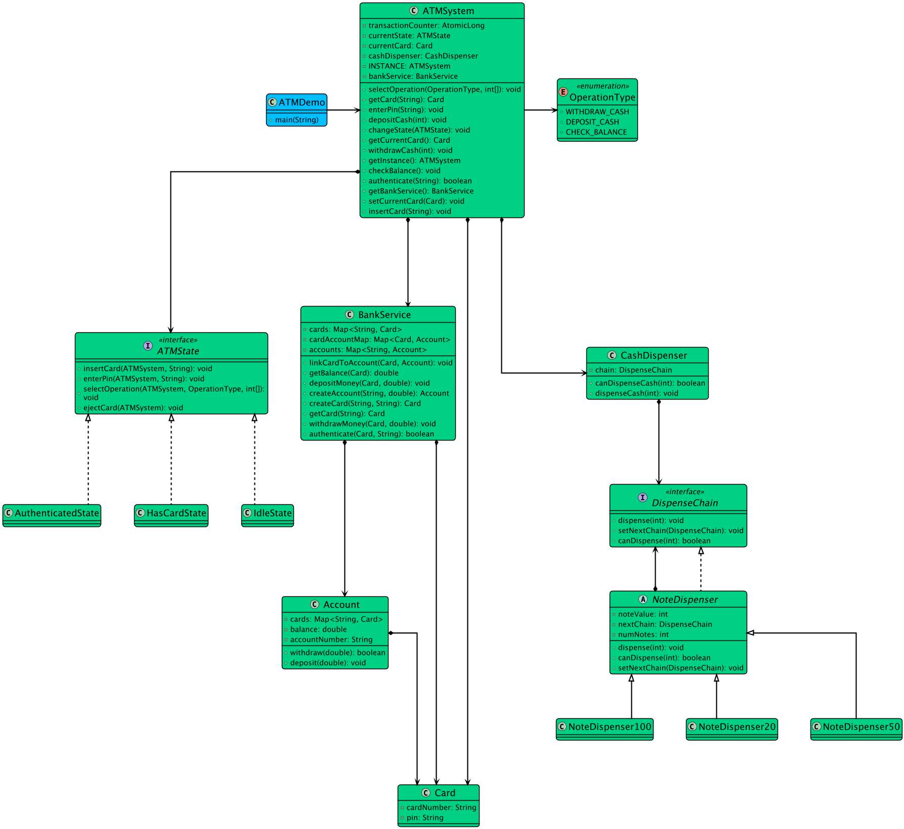
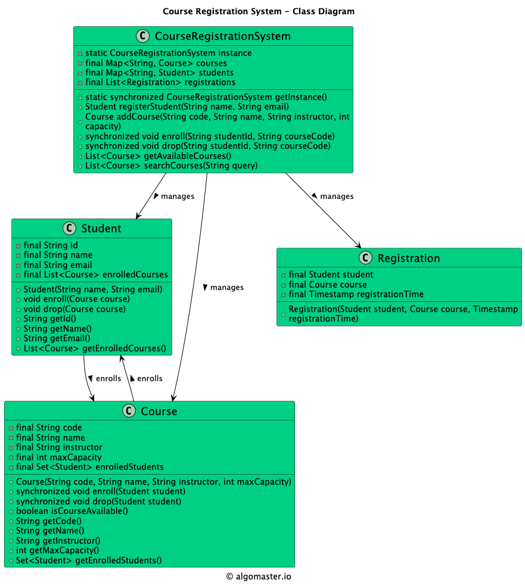
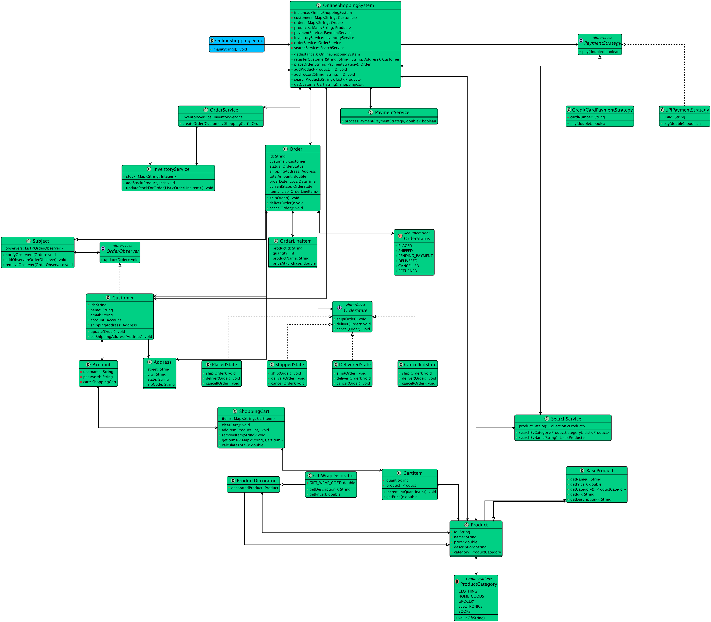

# UML Cheatsheet for LLD Interviews

A practical, interview-focused guide to drawing useful diagrams quickly.

## What to draw first
In most LLD rounds, start with a lightweight class diagram showing:
- entities
- key relationships
- interfaces where behavior varies
- cardinality where it matters
- major stateful objects

## Common relationship types

| Relationship | Meaning | Example |
|---|---|---|
| Association | one object knows about another | `Order -> Payment` |
| Aggregation | weak ownership | `Team -> Players` |
| Composition | strong ownership / lifecycle tied | `Order -> OrderLine` |
| Inheritance | is-a relationship | `Vehicle -> Car` |
| Interface implementation | behavior contract | `PricingStrategy <- SurgePricingStrategy` |

## Quick notation guidance
- Use boxes for classes.
- Put only important fields and methods.
- Prefer relationship labels over perfect notation if time is tight.
- Mark interfaces clearly.
- Mark multiplicity only when it clarifies a core rule.

## Good class box template
```text
+----------------------+
| BookingService       |
+----------------------+
| - repository         |
| - pricingStrategy    |
+----------------------+
| + createBooking()    |
| + cancelBooking()    |
+----------------------+
```

## What interviewers actually care about
- whether your entities make sense
- whether ownership boundaries are clear
- whether behavior is attached to the right abstraction
- whether important invariants are visible in the model

They do not care whether your arrowheads are UML-lawyer compliant.

## Diagram patterns you will reuse

### 1. Entity + service + repository
Use when persistence exists and orchestration is non-trivial.

```text
User --> BookingService --> BookingRepository
                |
                +--> NotificationService
```

### 2. Strategy variation point
Use when policy changes independently.

```text
BookingService --> AllocationStrategy
AllocationStrategy <|.. NearestDriverStrategy
AllocationStrategy <|.. HighestRatedDriverStrategy
```

### 3. State-driven workflow
Use when lifecycle matters.

```text
Order
- status: CREATED | CONFIRMED | CANCELLED | COMPLETED
```

### 4. Observer / notification fanout
Use when events trigger downstream actions.

```text
Subject --> Observer
OrderService --> EmailNotifier
OrderService --> SmsNotifier
```

## Common mistakes
- modeling database tables instead of domain objects
- introducing inheritance where composition is cleaner
- putting all behavior in one manager class
- drawing every helper class too early
- ignoring invariants like seat uniqueness or active-session uniqueness

## Reusable answer patterns

### Booking systems
Highlight:
- availability check
- reservation state
- confirmation path
- cancellation path
- double-booking prevention

### Payment systems
Highlight:
- payment state
- idempotency
- refund or reversal flow
- provider abstraction

### Feed or social systems
Highlight:
- user graph
- content entity
- notification flow
- ranking strategy

### Marketplace systems
Highlight:
- catalog entities
- inventory ownership
- order lifecycle
- payment integration
- notification or event hooks

## Visual references from this repo

<table>
  <tr>
    <td align="center"><strong>ATM</strong><br/></td>
    <td align="center"><strong>Parking Lot</strong><br/></td>
  </tr>
  <tr>
    <td align="center"><strong>Course Registration</strong><br/></td>
    <td align="center"><strong>Online Shopping</strong><br/></td>
  </tr>
</table>

## 5-minute interview diagram recipe
1. list actors
2. list entities with lifecycle
3. identify invariants
4. identify varying behavior
5. draw 5 to 8 core classes
6. add one main flow verbally

## Rule of thumb
A diagram is good if it helps you explain the design faster.
If it slows you down, it is showing off, not communicating.
